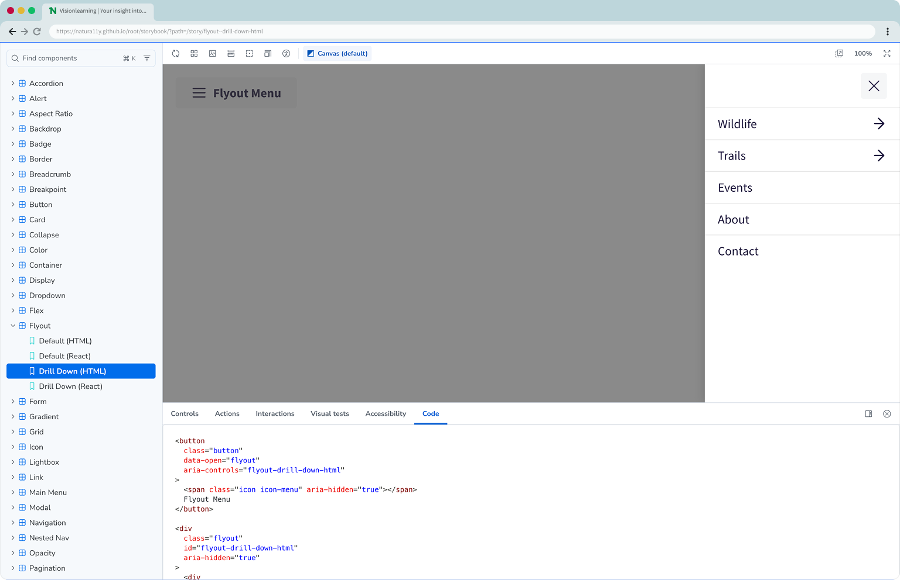
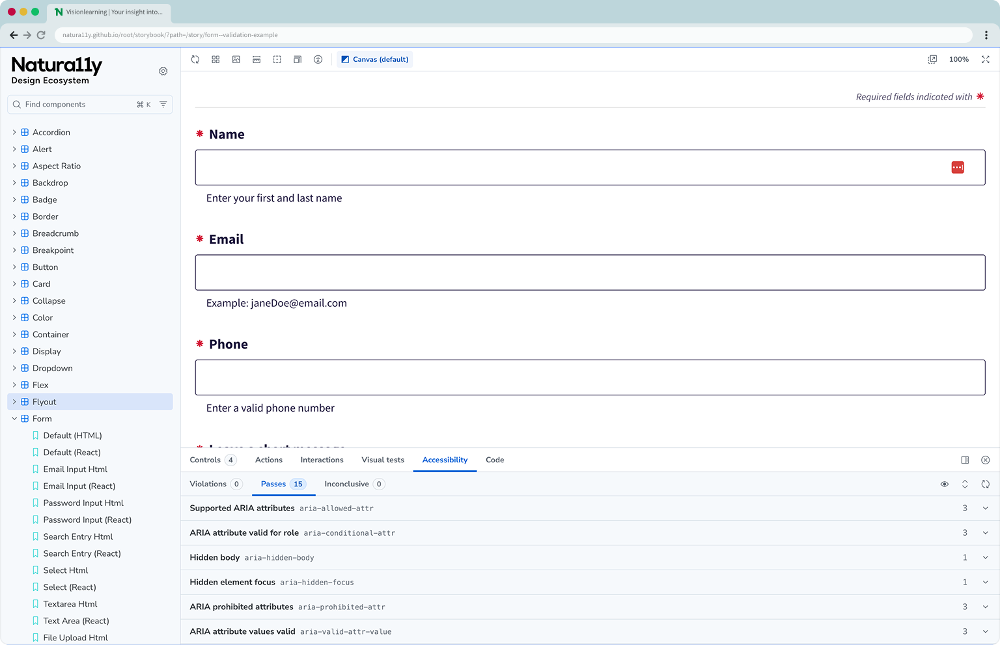
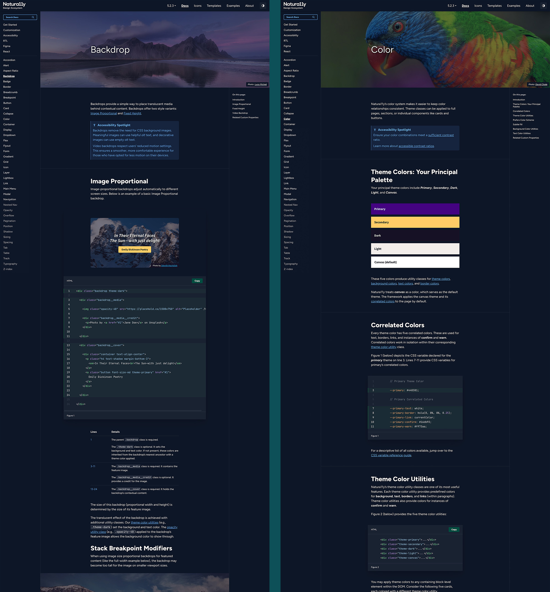

import LightboxImage from '../../components/LightboxImage.astro';
import designSystemArchitecture from '../../images/natura11y/design-system-architecture.jpg';

<CaseStudyOverview caseStudy={frontmatter.caseStudy}>

## Challenge

I created Natura11y to make it easier to build highly customized and accessible interfaces, because existing frameworks made that process unnecessarily difficult or restrictive. At the time, my consulting work included projects with complex, highly specific requirements. I was also working with the City of New York, where accessibility and inclusive design were becoming central to my design approach.

Frameworks like Bootstrap were fast at first, but imposed their own restrictions and became harder to customize as projects grew. I needed a foundation I could fully control, improve over time, and keep pace with emerging web technologies.

## Solution

Natura11y is an accessibility-first, platform-agnostic design ecosystem. Shared CSS and JavaScript, UI components, icons, Figma libraries, React components, and documentation provide a flexible foundation that teams can adopt at different levels. It can be used to create a website theme, to extend it with custom components, or to serve as the foundation for a complete branded design system.

## Result

Natura11y has reduced work that once took months to days while giving me more freedom to create highly customized, accessible interfaces. I have used it across client projects, including Visionlearning, and I am now using it to redesign the Cheetah Conservation Fund’s global web presence.

</CaseStudyOverview>

<TextBlock>

## Ecosystem architecture

As Natura11y expanded, I reorganized it into a monorepo that keeps its framework, React components, icons, documentation, and testing connected. I can now make a decision once and carry it across the entire ecosystem, reducing duplicated work and preventing its different parts from falling out of sync.

</TextBlock>

<FigureSingle width='medium' caption="Natura11y ecosystem architecture">

<LightboxImage
  src={designSystemArchitecture}
  alt="Diagram of the Natura11y monorepo connecting its Astro documentation and Storybook apps with Core, Icons, and React packages distributed through NPM and CDNs."
  caption="Natura11y ecosystem architecture"
/>

</FigureSingle>

<TextBlock>

### Codebase

Natura11y’s codebase is designed to be minimal and easy to maintain. Core serves as the shared foundation for the ecosystem, with Sass organized by component, utility, and feature, and focused vanilla JavaScript classes handling interactive behavior. React uses the same styles and imports only the Core utilities it needs, rather than recreating them in a separate implementation.

</TextBlock>

<FigureSingle>

</FigureSingle>

<TextBlock>

### Components (vanilla and React)

I designed Natura11y’s component library to work across both semantic HTML and React. The HTML examples pair accessible markup with focused vanilla JavaScript, while the React components handle behavior through props, state, refs, and hooks. Both use the same Core styles, utilities, and accessibility patterns.

This allows teams to work in either technology stack without creating a separate design system for each one. Components can stay visually and behaviorally aligned while still feeling native to the environment where they are used.

</TextBlock>

<FigureSideBySide>

<FigureSingle caption="Flyout component in Storybook" isContained={false} margin='margin-y-0'>

</FigureSingle>

<FigureSingle caption="Form component in Storybook" isContained={false} margin='margin-y-0'>

</FigureSingle>

</FigureSideBySide>

<Divider />

<TextBlock>

## Icon library

Natura11y includes its own icon library. The icon package is versioned alongside the source repository and contains the original vectors, also included in the Figma libraries. This allows designers and developers to easily add, modify, or update icons while ensuring design consistency across projects.

</TextBlock>

<FigureSingle>

    
</FigureSingle>

<Divider />

<TextBlock>

## Figma UI kits

The Figma UI Kit provides a collection of components and layouts that align perfectly with the front-end framework, giving interaction designers essential tools to create their own design systems.

</TextBlock>

<FigureSideBySide>

<FigureSingle caption="Lo-fi Figma UI Kit" isContained={false} margin='margin-y-0'>

</FigureSingle>

<FigureSingle caption="Hi-fi Figma UI Kit" isContained={false} margin='margin-y-0'>

</FigureSingle>

</FigureSideBySide>

<Divider />

<TextBlock>

## Public documentation

I built the documentation website using Astro, allowing me to mix framework examples with MDX for comprehensive documentation. Because Natura11y is inspired by the natural world, I associated each component and page with nature-themed images, all carefully selected from Unsplash with proper photographer credits. This was one of the most enjoyable parts of the project and gives the documentation a warm, welcoming feel that reflects the spirit of the system.

</TextBlock>

<ThemeWrapper>
<FigureSingle>

    
</FigureSingle>
</ThemeWrapper>

<TextBlock>

## Templates and examples

Templates offer unbranded, full-page layouts for common page types, providing accessible structure and best practices out of the box. Examples, in contrast, are small, branded comps designed to inspire; they show how Natura11y can be styled for different brands or aesthetics. Together, templates serve as blueprints while examples illustrate how styling works within Natura11y.

</TextBlock>

<ThemeWrapper>
<FigureSingle caption="Template pages for common interface patterns">

    
</FigureSingle>

<FigureSingle caption="Interactive examples showing Natura11y components in use">

    
</FigureSingle>
</ThemeWrapper>

<TextBlock>

## In the wild

Natura11y is not just a personal framework or design exercise. I use it on real client projects to move from early design ideas to accessible, production-ready interfaces with a shared foundation for design and code.

</TextBlock>

<FigureSingle>

    
</FigureSingle>

<TextBlock>

## Reflection

Natura11y did not begin as a complete design ecosystem. It grew through years of client work, experimentation, and iteration. As accessibility and design systems became part of my daily practice, Natura11y gave me a way to deepen those skills while building a reusable foundation shaped by the needs of real projects.

Natura11y was created long before generative AI became part of my workflow, but its clear architecture, reusable patterns, and shared design and code foundations make it especially well suited to working with AI. Today, I use it to put AI to work across the full design-system lifecycle, accelerating prototyping, implementation, testing, documentation, and maintenance, while I continue to guide the system's accessibility and overall direction.

</TextBlock>

<ProjectLinkButton linkUrl='https://gonatura11y.com/' title='Explore the Natura11y documentation' />
